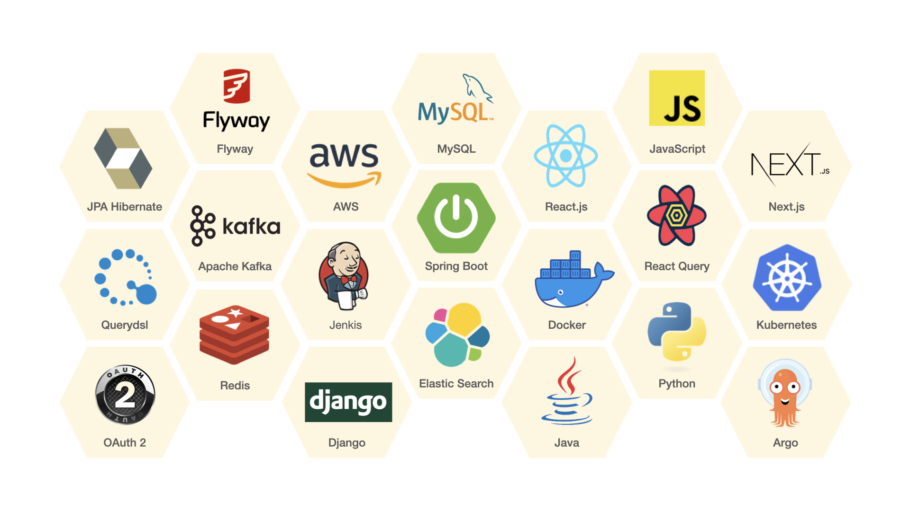
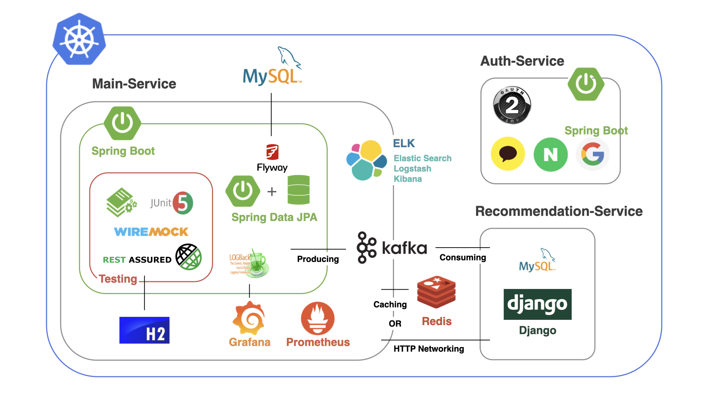
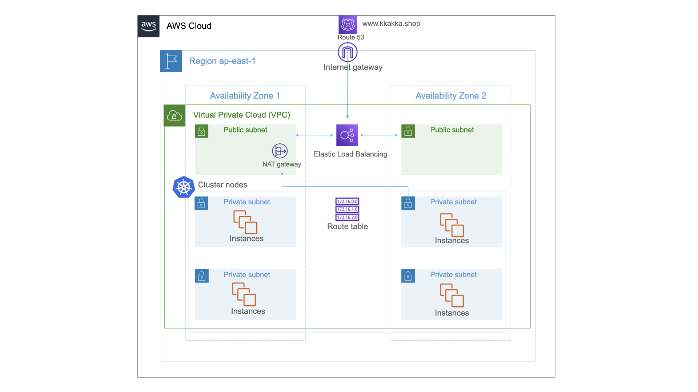
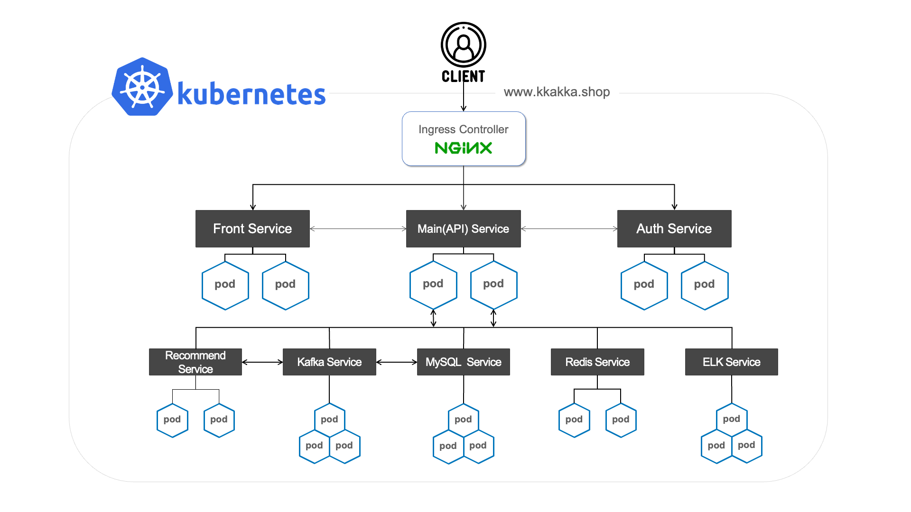
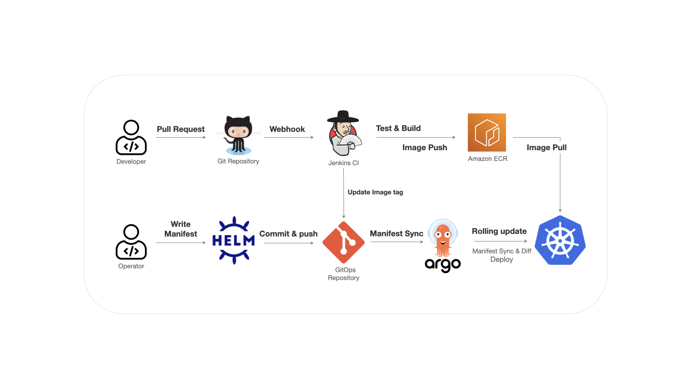

    <h1>
    까까
    </h1>

[까까](https://dev.kkakka.shop) 서비스를 직접 이용해보세요.

---

(본 문서는 밝은 화면에 최적화 되어 있습니다.)

## 🍪 Intro 

**까까**는 기존의 도매 중심 전문몰과 종합몰 중심의 간식 시장 문제 해결을 위한 **간식 전문 버티컬 플랫폼**입니다.

개인 소비자의 욕구를 충족하고 나아가 현명한 소비를 도울 수 있도록

✔️ 구매 이력에 따른 추천

✔️ 검색 기능 고도화

✔️ 프로모션 노출 확대

와 같은 **사용자 맞춤형 서비스**를 제공합니다.

## 🌈 Members

|                         [김혜연](https://github.com/sunhpark42)                          |                         [서지훈](https://github.com/devhyun637)                          |                          [신우주](https://github.com/sihyung92)                          |                         [오명주](https://github.com/soulgchoi)                          |                                                  [최솔지](https://github.com/soulgchoi)                                                  
|:-------------------------------------------------------------------------------------:|:-------------------------------------------------------------------------------------:|:-------------------------------------------------------------------------------------:|:------------------------------------------------------------------------------------:|:-------------------------------------------------------------------------------------------------------------------------------------:|
|  |  |  |  |  |
|                                     **Back-end**                                      |                                     **Front-end**                                     |                                 **Back-end & DevOps**                                 |                                     **Back-end**                                     |                                                      **Team Leader & Back-end**                                                       |

## ⚡️ Skills

## ⚙️ Architecture

### MSA

### AWS Cloud

### Kubernetes

### CI/CD

